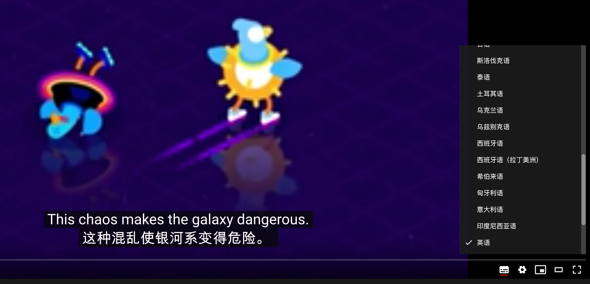

# Y2BDoubleSubs

Youtube双语字幕脚本 / Youtube double language subtitle 

两种方法实现Youtube双语字幕显示，hook_request.js 效果更佳，set_interval.js 供思路参考。

# Idea sharing

set_interval 方法从 “解说词” 功能中根据时间戳以及 .active 选择器获取当前应该显示的字幕，将其插入“自动翻译后”的字幕旁。
优点：CSS自定义，客制化程度高。
缺点：DOM消耗大；不能主动更新，需要等待 interval 更新；CSS 继承，宽度受父元素限制，可能造成文字挤在一起。

hook_request 方法会组装一个新的 xhr 请求翻译后的字幕，通过 xhook 拦截原请求，将新请求（翻译文字）和原请求（源字幕）中的文字部分进行合并。
优点：用户体验好，享受网站 CSS 计算属性；
缺点：遇到原字幕和翻译字幕不一一对应的时候很 egg pain，目前使用 filter 根据时间戳来判断，复杂度上升到了 O(n\*a\*b)，不过好在 a 基本是 1 或者 2，而 b 是一个句子中单词的数量，不会太大，所以都可以近似看作常数。

# Usage
hook_request 方法发布在 GreasyFork，浏览器安装油猴脚本后[一键安装](https://greasyfork.org/zh-CN/scripts/397363-youtube-double-language-subtitle-youtube-%E5%8F%8C%E8%AF%AD%E5%AD%97%E5%B9%95)

# Confuse
在我使用xhook进行拦截时(1.5版本前)，对于一些fetch请求，xhook可能做了一些header过滤（feature or bug？）导致虽然cookie正确，但一些重要的验证头并没有被发送（其中就包含 youtube 作为身份验证的 authorization 头），于是乎，youtube 后端并不能验证身份，返回401，造成“明明我登陆了点赞了订阅了前端也响应了但是实际上统统没有成功”的结果。

我先是邮件联系了xhook的作者，目前没有得到回应。由于目前水平有限，没有从xhook的源码中发现什么端倪，于是我将依赖的xhook更换成了ajax-hook，重写了一遍逻辑，这次没有出现问题。

如果有前端朋友知道 xhook 发送请求的 header 莫名其妙少掉的原因，还请不吝赐教 orz

# preview
